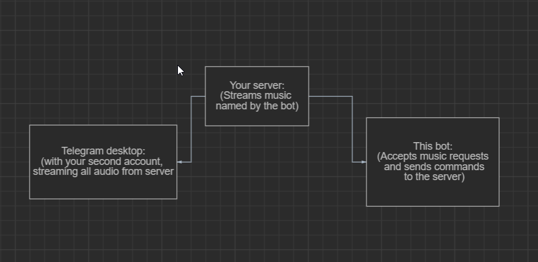

# Telegram Voice-Chat Bot

Telegram Voice-Chat Bot To Play Music From Various Sources In Your Group

# Support

1. All linux based os.
2. Windows
3. Mac

# Diagram

## Requirements

- Python 3.6 or higher
- A [Telegram bot token](//t.me/botfather)
- Bot needs to be admin in the chat, atleast give message delete permissions.
- Install `mpv` with

`pkg install mpv` - for Android,  `sudo apt-get install mpv` - for ubuntu, `sudo pacman -S mpv `  - for ArchLinux, I use arch btw
- For Windows Download mpv from https://sourceforge.net/projects/mpv-player-windows/files/ and run Mpv-installer as administrator the add mpv file to path envionment!

## Run

1. `git clone https://github.com/thehamkercat/Telegram_VC_Bot`, to download the source code.
2. `cd Telegram_VC_Bot`, to enter the directory.
3. `pip3 install -r requirements.txt`, to install the requirements.
4. `cp sample_config.py config.py`
5. Edit `config.py` with your own values.
6. If you are on linux follow [this](https://github.com/thehamkercat/Telegram_VC_Bot/blob/master/vnc.md) 
instruction to set up vnc. If you are using windows you can skip this step.
6. Download Telegram desktop from https://desktop.telegram.org , Log in using your second account, and connect 
to 
the 
voice chat in your group.
7. Follow [This](https://unix.stackexchange.com/questions/82259/how-to-pipe-audio-output-to-mic-input) to route 
your PC or Server's audio output to audio input. [For Linux]
8. If you're on windows, Follow 
[This](https://superuser.com/questions/1133750/set-output-audio-of-windows-as-input-audio-of-microphone) or install Virtual Audio Cable instead.
9. Run the bot `python3 main.py`
10. Open Telegram and start voice chat.
11. Send [commads](https://github.com/thehamkercat/Telegram_VC_Bot/blob/master/README.md#commands) to bot to 
play music.

> Watch The Video Tutorial if you still can't do this 

[How to deploy the Telegram Voice Chat Bot on VPS using Ubuntu/Debian](https://youtu.be/DozNTe_cydw)

## Commands
Command | Description
:--- | :---
/start | To Start The bot.
/help | To Show This Message.
/ping | To Ping All Datacenters Of Telegram.
/end | To Stop Any Playing Music (only works for current user playing and to Admins).
/jiosaavn <song_name> | To Play A Song From Jiosaavn.
/youtube <song_name> or <song_link> | To Search For A Song And Play The Top-Most Song Or Play With A Link.
/playlist <youtube_playlist_url> | To Play A Playlist From Youtube.
/telegram | To Play A Song Directly From Telegram File.
/radio | To Play Radio Continuosly.
/users | To Get A List Of Blacklisted Users.
/deezer | To Play A Song From Deezer.
Admin Commands:
/black | To Blacklist A User.
/white | To Whitelist A User.

## Note

1. More services will be added soon.
2. Termux is not completely supported yet, might take a week or two.
3. If you want any help you can ask [here](https://t.me/PatheticProgrammers)

## Credits
1. `https://github.com/cyberboysumanjay/JioSaavnAPI` [For JioSaavnAPI]
